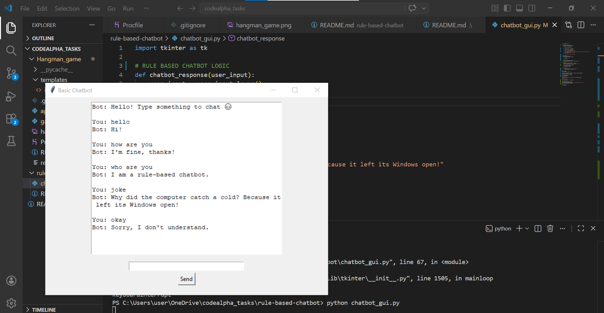

💬 Rule-Based Chatbot with GUI

This is a simple Rule-Based Chatbot built using Python.
It responds to user inputs based on predefined rules and also includes a Graphical User Interface (GUI) created with Tkinter for a better user experience.

🚀 Features
🤖 Rule-based responses using if-elif logic
💬 Interactive chat interface
🔄 Continuous conversation loop
🛠️ Technologies Used
Python
Tkinter (for GUI)
📁 Project Structure
rule-based-chatbot/
│── chatbot_gui.py
│── README.md
│── rule-based-chatbot-ss.png
▶️ How to Run
Make sure Python is installed on your system
Open the project folder in VS Code or terminal
Run the GUI chatbot:
python chatbot_gui.py
💡 Example Inputs
hello
how are you
who are you
bye
📸 Chatbot Screenshot

👩‍💻 Author
Sweta lodhi
⭐ Note
This project is beginner-friendly and demonstrates basic concepts of Python, loops, conditional statements, and GUI development.